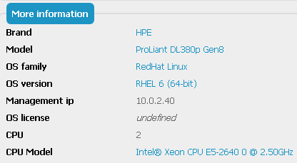
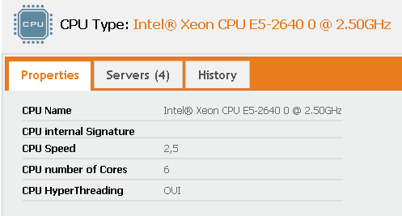
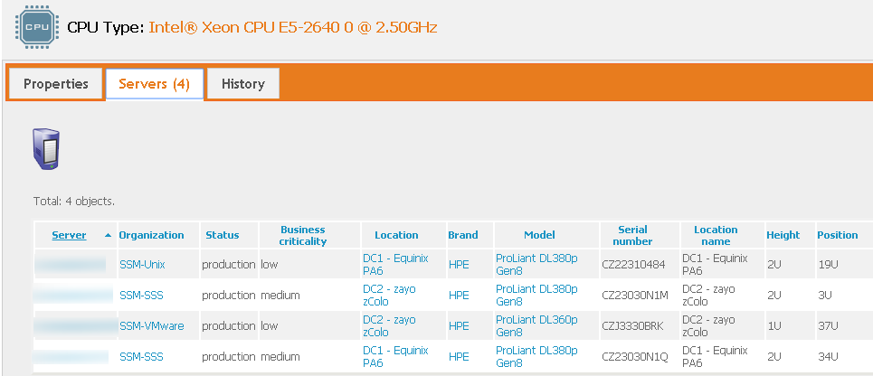

# schirrms-cpu-class
iTop extension - add a CPU class, and affects it to the 'Server' class

# Goal
This is one of my extensions to the incredible iTop tool. It's also my first contact with git, beware...

iTop give only one text field to describe the CPU type for a server. this was a little short for me.
I added that class permitting the description of a CPU, and then the assignement of this CPU to a server. It is also possible to create a new CPU type on the fly from the server view.
Version 1.1.0 adds a view of the servers using one specific CPU.
So I use the legacy CPU field as a num field, only to enumerate the number of CPUs.

Here, in the server view, the new field (In that case, this server has two Intel(R) Xeon CPU E5-2640 0 @ 2.50 GHz) :

By following the CPU Link, you can get more information about this CPU :

You can also have the list of Servers using this CPU :

# Installation
As for all my extensions, just download the zip file, and copy the 'schirrms-...' directory in your extensions directory, then rerun the setup as usual.

Enjoy :)